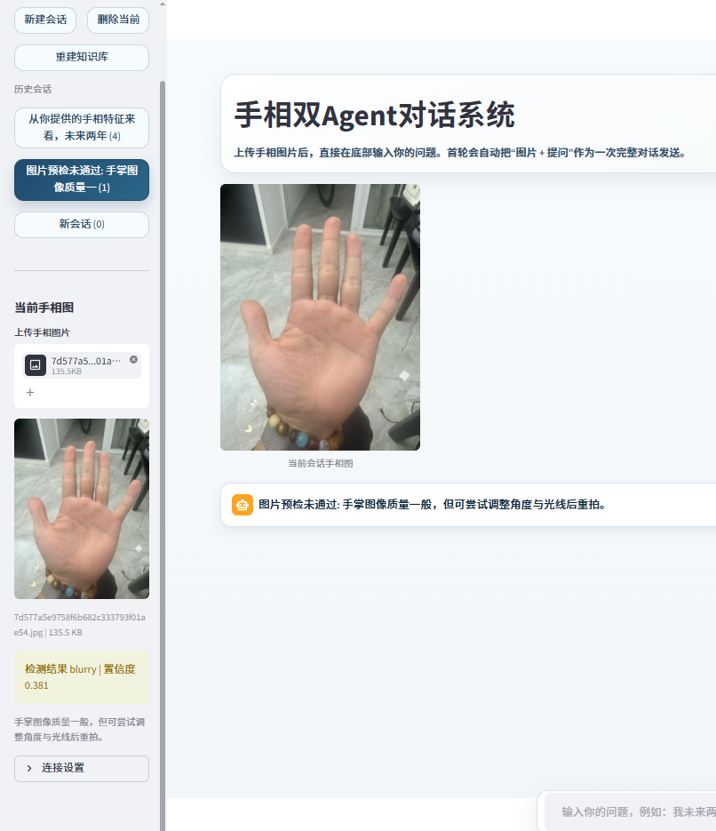
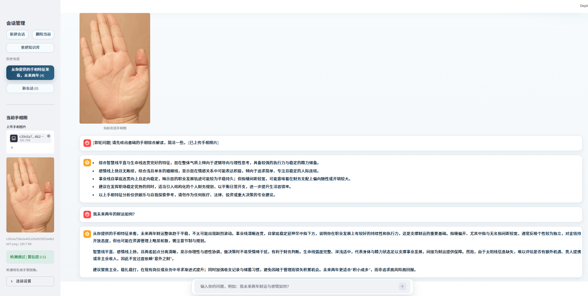

# HandsConsultantProject

一个基于双 Agent 和高级 RAG 的手相咨询项目。系统支持手相图片清晰度判断、结构化特征提取、首轮综合解读，以及围绕当前会话的多轮追问。

## 功能概览

- 图片预检：先判断是否为可用手相图，模糊或细节不足时直接提示重新上传。
- 首轮解读：提取生命线、智慧线、感情线、事业线等基础特征，并生成综合信息。
- 多轮问答：结合图片特征、首轮总结和本地知识库继续回答追问。
- 本地约束：通过规则库、问答库和图谱检索降低随意发挥。

## 置信度判断示意

当图片清晰度不足、掌纹模糊或局部细节不完整时，系统会拦截当前图片并提示用户重新上传。



## 完整会话流程

系统完整流程为：上传图片 -> 清晰度与可用性判断 -> 手相基础信息提取 -> 综合信息生成 -> 用户继续追问 -> 结合会话上下文与知识库进行回答。



## 项目结构

- app：后端主逻辑，包含 API、Agent、RAG 和服务层。
- prompts：中文提示词。
- knowledge：手相规则知识库、问答知识库和图谱数据。
- docs/images：README 展示图片。
- storage：本地会话与索引缓存。

## 快速启动

1. 安装依赖

```bash
pip install -r requirements.txt
```

2. 配置环境变量

参考 .env.example 新建 .env，并填写模型接口配置。

3. 启动后端

```bash
python -m uvicorn app.main:app --reload --port 8099
```

4. 启动前端

```bash
python -m streamlit run app.py --server.port 8501
```

## 说明

- 本项目内容偏民俗娱乐，不替代医学、法律和投资建议。
- 若使用公开仓库，请不要提交本地 .env、缓存文件和运行时数据。
